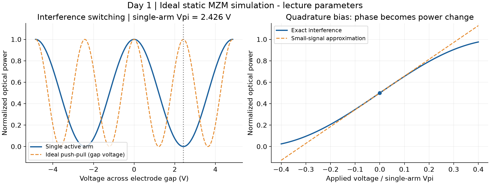

# TFLN Mach–Zehnder Modulator: from Pockels Effect to Traveling-Wave Response

An independent, one-week PIC learning and reproducibility project based on EEK5103 and:

Xuecheng Liu et al., *Capacitively-Loaded Thin-Film Lithium Niobate Modulator With Ultra-Flat Frequency Response*, IEEE Photonics Technology Letters **34**(16), 854–857 (2022). [DOI: 10.1109/LPT.2022.3178214](https://doi.org/10.1109/LPT.2022.3178214).

**Status: Day 1 complete.** The static model is implemented and checked. Equations (1)–(4), Figure 3 reproduction, and bandwidth sweeps are planned work, not claimed results. This repository contains no new experimental measurements and is not affiliated with the paper's authors.

[中文入门与七天计划](docs/learning_plan_zh.md) · [Day 1 物理推导](docs/day01_zh.md) · [Source and parameter ledger](docs/provenance.md) · [Paper reproduction specification](docs/paper_model_spec.md)



## Reproduce Day 1

Python 3.11 or newer and Git are sufficient to start. Tested environment versions are recorded in `requirements-lock.txt` and `docs/environment.md`.

```sh
python3 -m venv .venv
source .venv/bin/activate
python -m pip install -e '.[notebook]'
python -m unittest discover -s tests -v
python scripts/run_day01.py
jupyter lab notebooks/01_static_mzm.ipynb
```

For the exact recorded dependency versions, install `requirements-lock.txt` before installing this project with `python -m pip install -e . --no-deps`. The lock records one macOS/Python environment; other platforms may need a fresh dependency resolution.

The notebook also runs all explanatory cells; the script regenerates the figure, simulation data, and summary. The checked-in notebook includes executed results so it can be read without installing Jupyter.

## Day 1 benchmark

Using the Lecture 4 p.22 single-arm example (1550 nm, n_e=2.2, r33=30 pm/V, gap=10 µm, L=2 cm):

- Required index-change magnitude: 3.875 × 10⁻⁵.
- Half-wave voltage: 2.42612 V; Vpi L = 4.85224 V·cm.
- Ideal same-gap-voltage push-pull extension: 1.21306 V. This is an illustrative model extension, not a prediction for Liu's device.
- Balanced ideal outputs conserve optical power; transmission cycles from maximum to minimum and back over 2 Vpi.

## Scope and evidence

The later traveling-wave model will compare terminal loads of 20, 40, 50, 80 ohm and open circuit against **calculated** Figure 3. Measured Figure 7 is a separate evidence category. Frequency-dependent microwave loss and impedance inputs are plotted in the paper, but their underlying numerical arrays are not supplied in the inspected PDF. Reproduction must therefore distinguish digitized inputs from assumed parameters and report uncertainty.

The finite extension will vary length, RF loss and microwave–optical group-velocity mismatch, with a clearly defined first downward -3 dB crossing and censored results when no crossing occurs within the frequency range.

## Layout

- `src/tfln_mzm/`: reusable physics, all input quantities in SI units.
- `notebooks/`: guided learning with equations and executed examples.
- `scripts/`: deterministic figure and data generation.
- `tests/`: independent physical checks.
- `docs/`: learning plan, derivation, conventions, source ledger and limitations.
- `data/digitized/`: future curve samples and extraction metadata; currently no samples.
- `data/simulated/`: generated results, explicitly labelled.
- `figures/`: original plots generated by this project.
- `references/`: citation and source fingerprints; source PDFs stay outside Git.

## Public release status

A local Git repository is initialized. A public GitHub repository is not yet created. Before release, complete the reproduction report, review numerical claims and source attribution, select a license for original code, and publish the repository. Course slides, publisher PDFs, personal assignments and credentials are excluded. Source availability is documented without redistributing those files.
