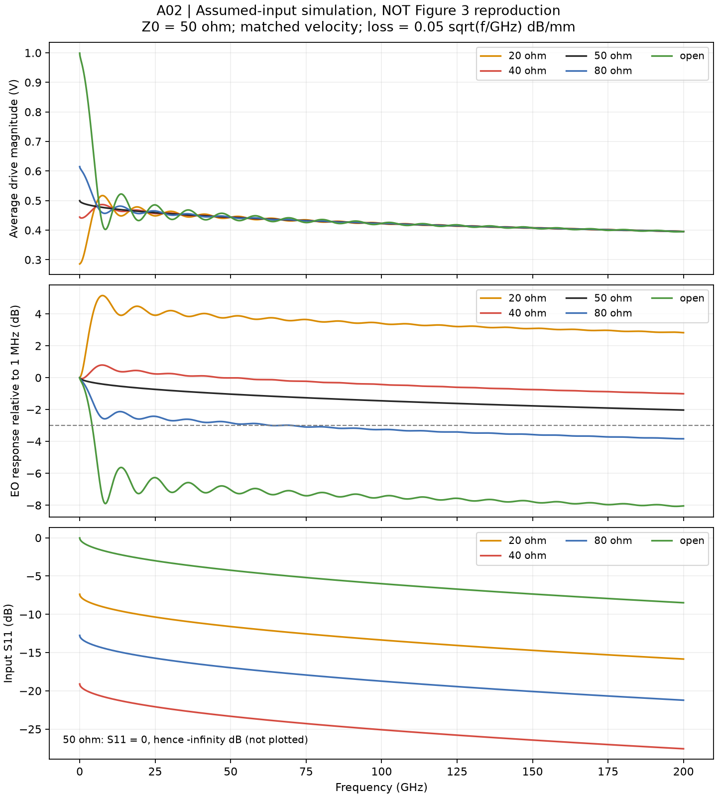

# TFLN Modulator: Liu 2022 Analytical Reproduction

An independent, one-week PIC learning and reproducibility project based on EEK5103 and:

Xuecheng Liu et al., *Capacitively-Loaded Thin-Film Lithium Niobate Modulator With Ultra-Flat Frequency Response*, IEEE Photonics Technology Letters **34**(16), 854–857 (2022). [DOI: 10.1109/LPT.2022.3178214](https://doi.org/10.1109/LPT.2022.3178214).

**Primary target:** paper equations (1)–(4) and Figure 3 average voltage, EO response and S11. Course-based static MZM material is auxiliary background, not a reproduction milestone.

**Status:** A01–A02 analytical model and bandwidth logic pass 27 current implementation tests. A03 extracts paper input/target curves with raster uncertainty and missing-region masks. A04 performs an independent, unfitted comparison: 40/50-ohm EO curves agree closely on supported samples, but S11 and several other series fail the predeclared diagnostic. Full Figure 3 reproduction is **not** established. Missing dispersion and normalization/input conventions require further audit.

[A03 extraction](experiments/track_A_reproduction/A03_digitization/RESULTS.md) · [A04 comparison and failures](experiments/track_A_reproduction/A04_digitized_comparison/RESULTS.md)

Run `python scripts/run_a04.py` to reproduce the numerical comparison from committed digitized data; no PDF required for that step.

[A02 boundary](experiments/track_A_reproduction/A02_frequency_response/BOUNDARY.md) · [A02 results](experiments/track_A_reproduction/A02_frequency_response/RESULTS.md)



Run `python scripts/run_a02.py` to regenerate this figure and the bandwidth/censor report.

[第一步学习与结果](docs/A01_learning_zh.md) · [A01 boundary](experiments/track_A_reproduction/A01_analytic_limits/BOUNDARY.md) · [A01 results](experiments/track_A_reproduction/A01_analytic_limits/RESULTS.md)

Run `python scripts/run_a01.py` for the DC-limit table; `python -m unittest discover -s tests -v` for the full suite.

Start with [论文复现边界](docs/BOUNDARIES.md), [模块接口与状态](docs/MODULES.md), [七天主线计划](docs/learning_plan_zh.md), and [A00 preflight](experiments/track_A_reproduction/A00_paper_baseline/RESULTS.md).

[Source and parameter ledger](docs/provenance.md) · [Paper equations and conventions](docs/paper_model_spec.md) · [Optional static MZM explanation](docs/learning/static_mzm_zh.md)

## Install and run the paper model

Python 3.11 or newer and Git are required. Tested local package versions are recorded in `requirements-lock.txt` and `docs/environment.md`.

```sh
git clone https://github.com/changanjian-lwy/tfln-mzm-liu2022-reproduction.git
cd tfln-mzm-liu2022-reproduction
python3 -m venv .venv
source .venv/bin/activate
python -m pip install -e '.[notebook]'
python -m unittest discover -s tests -v
python scripts/run_a01.py
```

The mainline result is written to `experiments/track_A_reproduction/A01_analytic_limits/dc_results.json`. Read that experiment's boundary and result report before interpreting the numbers.

Optional course background:

```sh
python scripts/run_day01.py
jupyter lab notebooks/01_static_mzm.ipynb
```

The executed static notebook is auxiliary. Its checks do not validate the paper's frequency response. For exact local dependency versions, install `requirements-lock.txt` before `python -m pip install -e . --no-deps`; other platforms may need fresh dependency resolution.

## Auxiliary static benchmark

Using the Lecture 4 p.22 single-arm example (1550 nm, n_e=2.2, r33=30 pm/V, gap=10 µm, L=2 cm):

- Required index-change magnitude: 3.875 × 10⁻⁵.
- Half-wave voltage: 2.42612 V; Vpi L = 4.85224 V·cm.
- Ideal same-gap-voltage push-pull extension: 1.21306 V. This is an illustrative model extension, not a prediction for Liu's device.
- Balanced ideal outputs conserve optical power; transmission cycles from maximum to minimum and back over 2 Vpi.

## Scope and evidence

The later traveling-wave model will compare terminal loads of 20, 40, 50, 80 ohm and open circuit against **calculated** Figure 3. Measured Figure 7 is a separate evidence category. Frequency-dependent microwave loss and impedance inputs are plotted in the paper, but their underlying numerical arrays are not supplied in the inspected PDF. Reproduction must therefore distinguish digitized inputs from assumed parameters and report uncertainty.

The finite extension will vary length, RF loss and microwave–optical group-velocity mismatch, with a clearly defined first downward -3 dB crossing and censored results when no crossing occurs within the frequency range.

## Layout

- `configs/`: source-labelled paper baseline; unknown inputs remain explicit.
- `experiments/`: per-experiment boundary, configuration report and conclusion.
- `src/tfln_mzm/`: reusable physics, all input quantities in SI units.
- `notebooks/`: guided learning with equations and executed examples.
- `scripts/`: deterministic figure and data generation.
- `tests/`: independent physical checks.
- `docs/`: learning plan, derivation, conventions, source ledger and limitations.
- `data/digitized/`: future curve samples and extraction metadata; currently no samples.
- `data/simulated/`: generated results, explicitly labelled.
- `figures/`: original plots generated by this project.
- `references/`: citation and source fingerprints; source PDFs stay outside Git.

## Public development repository

[GitHub repository](https://github.com/changanjian-lwy/tfln-mzm-liu2022-reproduction) · [Experiment index](experiments/README.md) · [Tools and working process](docs/TOOLS_AND_WORKFLOW_zh.md)

This is a work-in-progress reproduction, not a completed paper validation. Course slides, publisher PDFs, personal assignments, credentials and the local Python environment are excluded. The original paper is cited by DOI. A redistribution license for original code has not yet been selected; public visibility alone does not grant a reuse license.
